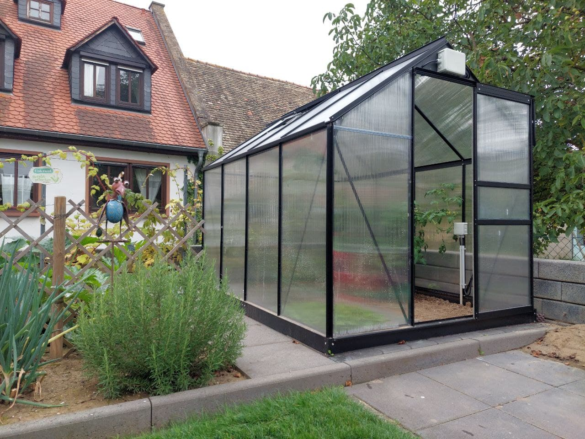
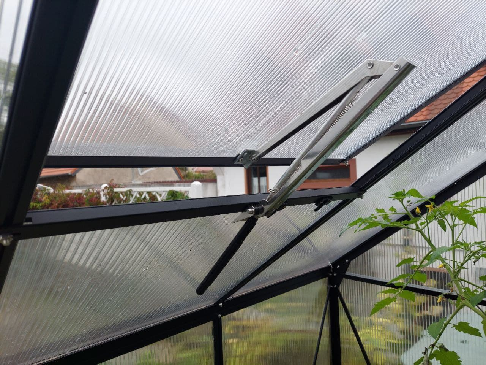
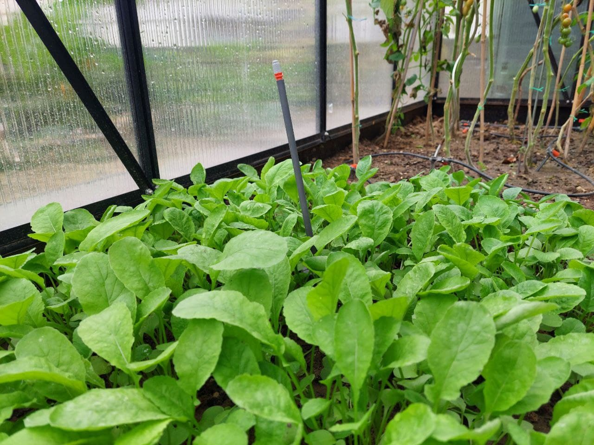
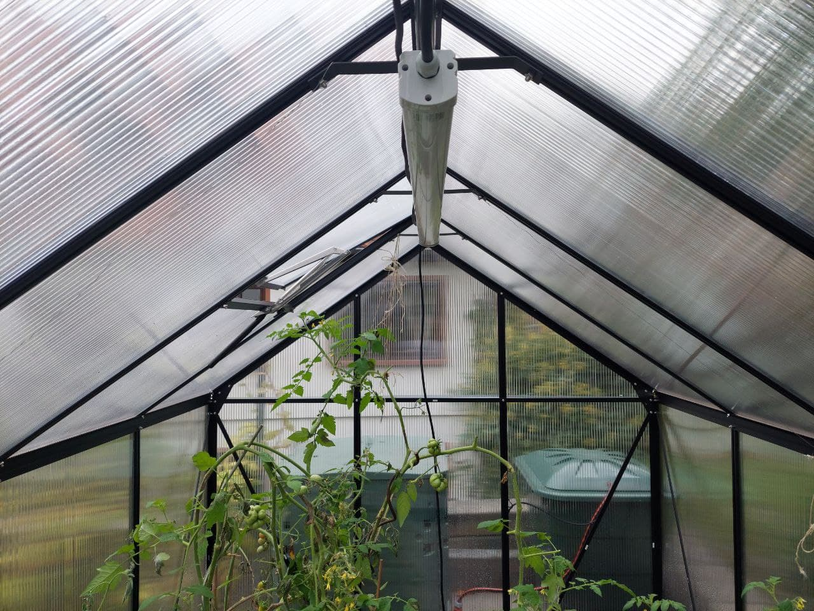
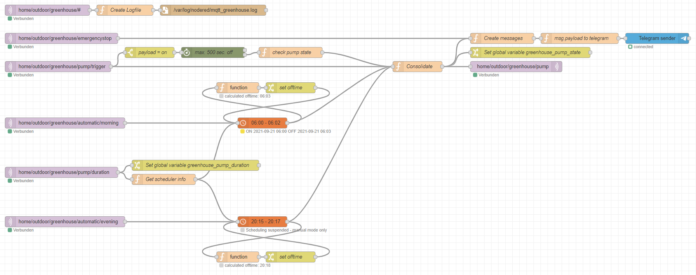
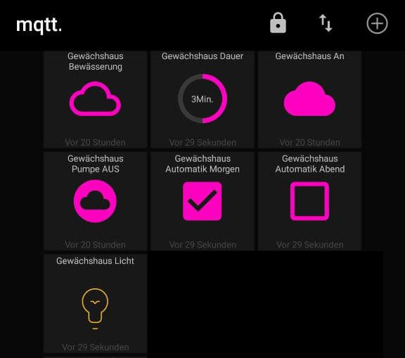

# Greenhouse

Automation and monitoring of greenhouse

> **⚠ NOTE**  
> Especially in product descriptions of this project it may happen that the language German is used. This project is still in the development phase, so far only the irrigation, light and ventilation have been realized. Further sensor technology such as temperature, humidity, brightness are in planning and will therefore be added successively.

## Vitavia Greenhouse "Apollo 5000" anthracite, 4 mm HKP



The baseline for this project is the Apollo 5000 from Vitavia in color anthracite. The supplied galvanized steel foundation protects the greenhouse against wind influences, we have made 6 point foundations á 70cm (arm length) concreted for this. The construction is not quite easy with the included instructions, is supplemented here by numerous private construction videos on YouTube.

## Ventilation

We deliberately chose a mechanical variant for ventilation: 

__Thermovent® Ventomax® Sesam Spiro® - Orbesen Teknik Denmark__

The Ventomax® vent opener is a well-proven standard hydraulic cylinder. The Thermovent® give you a very cost effective vent opener with a brilliant corrosion protection. The Sesam Spiro® keeps the hydraulic cylinder inside the greenhouse no matter if the window is open or closed. 

* Website: https://orbesenteknik.com/ 
* YouTube: https://www.youtube.com/watch?v=8WHmjoG84Yk



## GARDENA MIKRODRIP SYSTEM

The __GARDENA Basic Unit 1000__ reliably reduces water pressure to __about 1.5 bar__ for optimal operation of drippers and nozzles.

https://www.gardena.com/de/produkte/bewasserung/micro-drip-system/basisgerat-1000/900909901/



## PURCHASE LIST

We get a discount at OBI, so the following list is only illustrative. Buy the products in the DIY store or specialty store of your trust!

It's important to note that although an IP66 enclosure is waterproof against hose-directed water, rain or snow, it's not intended to be submerged in water.

| Menge | Position | OBI Link | Kosten |
|---|---|---|---|
| 1 | Garantia Regentonne Rund 310 l Grün | https://www.obi.de/regentonnen-wasserzapfstellen/garantia-regentonne-rund-310-l-gruen/p/6739700 | 35,99 € |
| 1 | Gardena Regenfasspumpe 4700/2 inox | https://www.obi.de/elektro-pumpen-hauswasserwerke/gardena-regenfasspumpe-4700-2-inox/p/9508235 | 79,99 € |
| 1 | Gardena Classic Schlauch 13mm (1/2") 18 m | https://www.obi.de/gartenschlaeuche/gardena-classic-schlauch-13mm-1-2-18-m/p/3062437 | 14,99 € |
| 2 | Gardena Schlauchstück 13 mm (1/2") / 15 mm (5/8") | https://www.obi.de/anschluesse-kupplungen/gardena-schlauchstueck-13-mm-1-2-15-mm-5-8-/p/9402397 | 4,99 € |
|   | Elektroinstallation | |
| 1 | OBO Abzweigkasten Aufputz 190 mm x 150 mm Grau IP66 | https://www.obi.de/abzweigkasten/obo-abzweigkasten-aufputz-190-mm-x-150-mm-grau-ip66/p/1801471 | 14,99 € |
| 1 | OBO Abzweigkasten Aufputz 114 mm x 114 mm Grau IP66 inkl. Klemmleiste | https://www.obi.de/abzweigkasten/obo-abzweigkasten-aufputz-114-mm-x-114-mm-grau-ip66-inkl-klemmleiste/p/1801455 | 8,49 € |
| 1 | Emskabel Erdkabel NYY-J 3 x 1,5 mm² Schwarz 25 m | https://www.obi.de/erdkabel/emskabel-erdkabel-nyy-j-3-x-1-5-mm-schwarz-25-m/p/9053521 | 21,49 € |
| 1 | Wago Compact Klemme 3 x 0,14 mm² - 4 mm² 50 Stück | https://www.obi.de/verbindungsklemmen/wago-compact-klemme-3-x-0-14-mm-4-mm-50-stueck/p/1825496 | 13,49 € |
| 1 | Wago Compact Klemme 5 x 0,14 mm² - 4 mm² 25 Stück | https://www.obi.de/verbindungsklemmen/wago-compact-klemme-5-x-0-14-mm-4-mm-25-stueck/p/1825504 | 10,49 € |
| 2 | Anbaustutzen-Set M25 Grau 5 Stück | https://www.obi.de/feinsicherungen/anbaustutzen-set-m25-grau-5-stueck/p/3214913 | 2,99 € |
| 2 | Isolierrohr starr EN 25 Länge 2 m | https://www.obi.de/leerrohre/isolierrohr-starr-en-25-laenge-2-m/p/7562515 | 1,89 € |
|   | Gardena Micro Drip Komponenten | |
| 1 | Gardena Micro Drip Basisgerät 1000 für Wasserdurchfluss von 1.000 l/h | https://www.obi.de/micro-drip-systeme/gardena-micro-drip-basisgeraet-1000-fuer-wasserdurchfluss-von-1-000-l-h/p/2068997 | 12,79 € |
| 1 | Gardena Verteilerrohr 4,6 mm (3/16") - 15 m | https://www.obi.de/micro-drip-systeme/gardena-verteilerrohr-4-6-mm-3-16-/p/9438615 | 8,99 € |
| 1 | Gardena Absperrventil 4,6 mm (3/16") - 2 Stück im Paket | https://www.obi.de/micro-drip-systeme/gardena-absperrventil-4-6-mm-3-16-/p/6076640 | 4,39 € |
| 2 | Gardena regulierbarer Reihentropfer - 10 Stropfer im Paket | https://www.obi.de/micro-drip-systeme/gardena-regulierbarer-reihentropfer/p/6076749 | 9,29 € |
| 1 | Gardena T-Stück 4,6 mm (3/16") - 10 Stück im Paket | https://www.obi.de/micro-drip-systeme/gardena-t-stueck-4-6-mm-3-16-/p/6076525 | 5,79 € |
| 1 | Gardena Rohrhalter 4,6 mm (3/16") - 10 Stück im Paket | https://www.obi.de/micro-drip-systeme/gardena-rohrhalter-4-6-mm-3-16-/p/9438516 | 4,99 € |
|   | Licht Komponenten | |
| 1 | Ritos LED-Feuchtraumleuchte mit Sensor Grau 24 W | https://www.obi.de/feuchtraumleuchten/ritos-led-feuchtraumleuchte-mit-sensor-grau-24-w/p/8015943 | 34,99 € |

Frequently, it is also useful to buy starter packages, in which, for example, the basic device and individual drippers and manifold are already present.

## WATER TON

Requirements:
- < 100 €
- 300-500 Litres
- Robust and UV resistant
- Dimensions: max. 1m x 1m (4x 50cm)
- Cover included (Mosquitoes)

## WATER PUMP

Requirements:
- < 200 €
- Pump drive: Self-priming __Jet-Pump__ (The difference between jet pumps and multistage centrifugal pumps is that jet pumps are self-priming. Multistage centrifugal pumps are normal priming, i.e. the suction line and the pump must be completely filled with water in order to be able to pump water.)
- Minimum Outlet pressure: 2 bar (> 1,5 bar input MicroDrip-System)
- 230V Powered (no battery)
- Can be switched on and off via power supply
- Suction connection: 1/2-Zoll
- Minimum self-suction height: > 4 metres 
- Built-in float switch to prevent the pump from running dry
- Low operating noise level (out of consideration for neighbors)
- Optional: integrated non-return valve

### LIGHT

Ritos LED-Feuchtraumleuchte mit Sensor Grau 24 W
- Feuchtraumlampe inkl. LED 24 W, 2.800 lm, Tageslichtweiß (6.500 K)
- Robuster Kunststoff in neutraler, grauer Farbgebung
- Schutzklasse IP65 - geschützt gegen Strahlwasser aus beliebigem Winkel
- Integrierter HF-Sensor ermöglicht automatisches Ein- und Ausschalten
- Maße (H x B x T): 122 cm x 5,6 cm x 6,1 cm



## FEATURES

- Connects to the Wireless Access Point / Wifi Router
- Securely connects to the MQTT Broker (TLS)
- Subscribes to the desired MQTT topics
- Handles incoming MQTT messages
- Controls ESP8266 Chip Level Data Pins
- Sends a heartbeat signal to the MQTT broker periodically
- Switches a double relay for cistern pump and a socket
- Checks the status of the pump and switches it off automatically after a certain time (threshold value) if no switch-off signal is received by the specified time (protection against greenhouse flooding)
- Measuring temperature and humidity with a FS200-SHT10 sensor

## REQUIREMENTS

- Wemos D1 Mini (should work with other Arduino microcontrollers too)
- PlatformIO or Arduino IDE (for Arduino IDE you have to move files from /src to root-folder)
- MQTT Broker such as the Mosquitto MQTT Broker (https://mosquitto.org/)
- ControllApp such as MQTT Dash (https://play.google.com/store/apps/details?id=net.routix.mqttdash&hl=en)

## INSTALL AND USAGE

### PINOUT

| Sensor-Description | Sensor-PIN | Arduino-PIN | GPIO |
| --- | --- | --- | --- |
| SRD-05VDC-SL-C Relais	| GND | GND | - |
| SRD-05VDC-SL-C Relais	| IN1 | D5 | GPIO 14 |
| SRD-05VDC-SL-C Relais	| IN2 | D6 | GPIO 12 |
| SRD-05VDC-SL-C Relais	| VCC	| 5.0 V |	- |
| SRD-05VDC-SL-C Relais	| NO1 + COM1 | Phase L (230V) Pump | - |
| SRD-05VDC-SL-C Relais	| NO2 + COM2 | Phase L (230V) Light | - |
| FS200-SHT10 soil temperature and humidity sensor | VCC (RED) | 3.3 V | - |
| FS200-SHT10 soil temperature and humidity sensor | GND (BLACK) | GND | - |
| FS200-SHT10 soil temperature and humidity sensor | SDA (GREEN) | D2 | GPIO 4 |
| FS200-SHT10 soil temperature and humidity sensor | SCK/SCL (YELLOW) | D1 | GPIO 5 |

### INTEGRATION OF A SWITCH

After some research, it is basically possible **in parallel to the relay to switch a switch**, which is suitable for outdoor use. This allows the pump to be switched on and off outside the watering periods.

### LIBRARIES ###

- PubSubClient by Nick O'Leary
- esp8266_mdns by dunk
- SHT1x-ESP by Bernd Giesecke (Works on 3.3V without external 10k resistor)

Tested but but library does not work with D1 Mini
- SHT1x by Practical Arduino - The Book
- SHT1x by Vincent Pang

## SENSORS

### HUMIDITY AND TEMPERATURE FS200-SHT10

Requirements:
- Measuring range 0 ... 100% rH, -20 ... +100°C
- Splash-proof for outdoor applications

**Sharainn soil moisture sensor, FS200-SHT10 3.3-5 V soil temperature and humidity sensor probe** - 20 100-100 ℃ 0-100% relative humidity sensor for agricultural greenhouses.

https://www.amazon.de/gp/product/B08M64WS15/ref=ppx_yo_dt_b_search_asin_title?ie=UTF8&psc=1

#### DESCRIPTION

The soil temperature and humidity probe, using the original temperature and humidity sensors as the core component, can be directly connected to the single chip microcomputer for use. With very high consistency, it can be completely interchangeable. The probe has the characteristics of temperature resistance, pressure resistance, loss of ability, suitability for agricultural greenhouse, flowers, nursery, lawn and other needs to detect soil temperature and humidity.

#### TECHNICAL DATA

- Model: FS200 - SHT10
- Type: temperature and humidity
- Production process: integration
- Output signal: numeric type
- Technical parameters:
- Working voltage: 3.3-5V
- Operating current: 15mA
- Temperature measuring range: - 20 ~ 100
- Humidity measurement range: 0 ~ 100% rH
- Working conditions: - 20 90 ca. 90 , 0 ca. 99% rH
- Storage conditions: - 20 ca. 80 ca., 0 ~ 95% rH
- Weight: 70g

### UNDERSTANDING RELAY HIGH AND LOW

To switch the relay it is necessary to define the two GPIOs of the Arduino with pinMode as output.
By default, the Arduino microcontroller then switches the output to LOW, which means that the connected relay is switched on, i.e. the pump is running. To prevent this, the PIN must be set to HIGH **before** defining it as an output.
```
  digitalWrite(relayPump, HIGH);
  pinMode(relayPump, OUTPUT);
  digitalWrite(relaySocket, HIGH);
  pinMode(relaySocket, OUTPUT);
```

## DIRECTORIES AND FILES

- src/greenhouse.ino - The main programm code
- src/config.h - GPIO configuration, definition of threshold values, etc.
- src/credentials.h.sample - Sample configuration file for WiFi and MQTT credentials (please rename to credentials.h)
- flows.json - The Node-RED worflow as JSON import file
- README.md - The manual for this Arduino Script
- LICENSE - The license notes for this Arduino script
- platformio.ini - Wemos D1 Mini Configuration for PlatformIO

## AUTOMATION WITH NODE-RED

If the pump can now be switched on and off via the MQTT Broker from anywhere in the world, it is naturally obvious to implement automation here. To cover this logic with the Arduino itself and to write it in C-code is quite feasible, but I decided to use the Framwork Node-RED for this, because here workflows can be created without much programming effort.

### NODE-RED MODULES REQUIREMENTS

- node-red-contrib-schedex
- node-red-contrib-stoptimer
- node-red-contrib-telegrambot (optional if you would like to get status messages)

### NODE-RED FLOW

Node-RED works with so-called flows, which can be imported and exported. 



An example of a flow can be found in **flows.json** in the github repository.

### MQTT TOPICS

| MQTT Topic | Description | Possible values |
| --- | --- | --- |
| home/outdoor/greenhouse/pump | Switches the pump on or off | on, off |
| home/outdoor/greenhouse/pump/trigger | Node-RED: Triggers the Node-RED Workflow | on |
| home/outdoor/greenhouse/light | Switches the pump on or off | on, off |
| home/outdoor/greenhouse/light/trigger | Node-RED: Triggers the Node-RED Workflow | on |
| home/outdoor/greenhouse/heartbeat | Heartbeat for troubleshooting | on |
| home/outdoor/greenhouse/emergencystop | Threshold value for pump runtime reached, Arduino has triggered Emergency STOP | on |
| home/outdoor/greenhouse/automatic/morning | Node-RED: Enables or disables automatic irrigation in the morning | suspended false, suspendet true |
| home/outdoor/greenhouse/automatic/evening | Node-RED: Enables or disables automatic irrigation in the evening | suspended false, suspendet true |
| home/outdoor/greenhouse/pump/duration | Node-RED: Irrigation duration by MQTTDash range function | Values: 1.0 to e.g. 5.0 Minutes |

## CONTROL AND MANAGEMENT

### MQTTDASH

A really outstanding Android app is MQTTDash, which establishes a connection to MQTTBroker, where buttons, graphs, switches, text fields, images and much more can be embedded. Take a look at the screenshot below.
https://play.google.com/store/apps/details?id=net.routix.mqttdash&hl=en



### TELEGRAM

For status messages I use Telegram, here is a well described API and corresponding plugins for Node-RED.

## LICENSE

Greenhouse and all individual scripts are under the BSD 3-Clause license unless explicitly noted otherwise. Please refer to the LICENSE